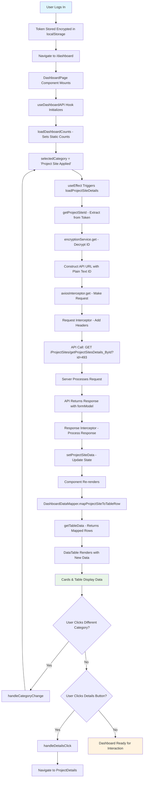

# Dashboard Control Flow Documentation

## 📋 Overview
This document provides a comprehensive guide to understand how the dashboard works in the CEI React application, from login to displaying data. It covers the complete data flow, API integration, state management, and user interactions.

---

## 🏗️ Architecture Overview

```
┌─────────────────┐    ┌─────────────────┐    ┌─────────────────┐
│   User Login    │───▶│  Token Storage  │───▶│   Dashboard     │
│                 │    │   (Encrypted)   │    │   Component     │
└─────────────────┘    └─────────────────┘    └─────────────────┘
                                                       │
                                                       ▼
┌─────────────────┐    ┌─────────────────┐    ┌─────────────────┐
│   API Response  │◀───│ Axios Interceptor│◀───│ useDashboardAPI │
│   Processing    │    │   & Request     │    │     Hook        │
└─────────────────┘    └─────────────────┘    └─────────────────┘
                                                       │
                                                       ▼
┌─────────────────┐    ┌─────────────────┐    ┌─────────────────┐
│   UI Rendering  │◀───│  Data Mapping   │◀───│  State Update   │
│   (Cards/Table) │    │  & Transform    │    │                 │
└─────────────────┘    └─────────────────┘    └─────────────────┘
```

---

## 🔐 1. Authentication & Token Storage

### 1.1 Login Process
```typescript
// Location: src/pages/login/LoginPage.tsx
const loginUser = async (credentials) => {
  const response = await axiosInterceptor.post('/Auth/Login', credentials);
  
  if (response.success) {
    // Server returns encrypted token data
    localStorage.setItem('token', JSON.stringify(response.data));
    navigate('/dashboard');
  }
};
```

### 1.2 Token Structure (Encrypted)
```json
{
  "userId": "S61jEKB/lV8e77S7P90y1A==",           // Encrypted user ID
  "projectSiteId": "ZeKcdv5MNVa3 zo6qjDmbg==",    // Encrypted project site ID (decrypts to "493")
  "roleName": "encrypted_role_data",               // Encrypted role (decrypts to "CONS")
  "firstName": "encrypted_first_name",             // Encrypted first name
  "lastName": "encrypted_last_name",               // Encrypted last name
  "token": "jwt_token_string",                     // JWT token for authentication
  "expiry": "2025-08-22T10:30:00Z"                // Token expiry time
}
```

### 1.3 Security Considerations
- All sensitive data is encrypted using AES encryption
- Only authentication token and expiry are stored in plain text
- Decryption happens in-memory only when needed
- No sensitive data is logged or exposed in plain text

---

## 🚀 2. Dashboard Page Load

### 2.1 Route Navigation
```typescript
// Location: src/router/AppRouter.tsx
<Route path="/dashboard" element={<DashboardPage />} />
```

### 2.2 Component Initialization
```typescript
// Location: src/pages/dashboard/dashboard.tsx
const DashboardPage: React.FC = () => {
  // State initialization
  const [selectedCategory, setSelectedCategory] = useState<Category>('Project Site Applied');
  const [selectedDropdownValue, setSelectedDropdownValue] = useState<string>('');
  const [isMobileView, setIsMobileView] = useState(false);
  
  // Custom hook for API operations
  const {
    projectSiteData,        // Stores API response data
    dashboardCounts,        // Stores card counts (static for now)
    loading,               // Loading state for UI
    error,                // Error state for error handling
    loadProjectSiteDetails, // Function to load project site data
    getCountForCategory    // Function to get count for specific category
  } = useDashboardAPI();
  
  // Responsive design handler
  useEffect(() => {
    const handleResize = () => {
      setIsMobileView(window.innerWidth <= 475);
    };
    handleResize();
    window.addEventListener('resize', handleResize);
    return () => window.removeEventListener('resize', handleResize);
  }, []);
};
```

---

## 🎣 3. Custom Hook (useDashboardAPI) Deep Dive

### 3.1 Hook Structure
```typescript
// Location: src/hooks/useDashboardAPI.ts
export const useDashboardAPI = () => {
  // State management
  const [projectSiteData, setProjectSiteData] = useState<ProjectSiteData | null>(null);
  const [dashboardCounts, setDashboardCounts] = useState<DashboardCounts>({
    projectSiteApplied: 1,  // Static count (API endpoint not available)
    rejected: 0,
    inbox: 0,
    closed: 0
  });
  const [loading, setLoading] = useState(false);
  const [error, setError] = useState<string | null>(null);
  
  // Functions
  const getProjectSiteId = (): string | null => { /* ... */ };
  const loadDashboardCounts = async () => { /* ... */ };
  const loadProjectSiteDetails = useCallback(async (category: string) => { /* ... */ }, []);
  const getCountForCategory = (category: string): number => { /* ... */ };
  
  // Initial data load
  useEffect(() => {
    loadDashboardCounts();
  }, []);
  
  return {
    projectSiteData,
    dashboardCounts,
    loading,
    error,
    loadProjectSiteDetails,
    getCountForCategory,
    refetchCounts: loadDashboardCounts
  };
};
```

### 3.2 Interface Definitions
```typescript
interface ProjectSiteData {
  projectSiteId?: number;                    // Unique identifier for project site
  projectSiteApplicationType?: number;       // Type: 1=Wireman, 2=Contractor/Supervisor
  address1?: string;                         // Primary address
  address2?: string;                         // Secondary address
  users?: {
    userProfileMapping?: {
      userProfile?: {
        firstName?: string;                  // Applicant's first name
        lastName?: string;                   // Applicant's last name
        mobileNo?: string;                   // Contact number
        commuAddress1?: string;              // Communication address line 1
        commuAddress2?: string;              // Communication address line 2
      }
    }
  };
  applications?: any[];                      // Related applications (if any)
}

interface DashboardAPIResponse {
  formModel?: ProjectSiteData;               // Main data model
  combinedAgendaModel?: any;                 // Additional agenda data
  isEditAllowed?: boolean;                   // Edit permission flag
  isLocked?: boolean;                        // Lock status
  hasError?: boolean;                        // Error indicator
  errorDesc?: string;                        // Error description
}

interface DashboardCounts {
  projectSiteApplied: number;                // Count for "Project Site Applied" card
  rejected: number;                          // Count for "Rejected" card
  inbox: number;                            // Count for "Inbox" card
  closed: number;                           // Count for "Closed" card
}
```

---

## 📊 4. Dashboard Component useEffect Flow

### 4.1 Category Change Effect
```typescript
// Triggers API call when category changes
useEffect(() => {
  console.log('🔄 [Dashboard]: Effect triggered for category:', selectedCategory);
  loadProjectSiteDetails(selectedCategory);
}, [selectedCategory, loadProjectSiteDetails]);
```

### 4.2 Effect Execution Timeline
1. **Component Mount**: `selectedCategory` is initialized as "Project Site Applied"
2. **useEffect Triggers**: Immediately after component mount
3. **API Call Initiated**: `loadProjectSiteDetails("Project Site Applied")` is called
4. **State Updates**: Loading state changes trigger re-renders
5. **Data Display**: Final data is rendered in table

---

## 🔍 5. Project Site ID Extraction & Decryption

### 5.1 Token Parsing Process
```typescript
const getProjectSiteId = (): string | null => {
  try {
    // Step 1: Retrieve encrypted token from localStorage
    const tokenStr = localStorage.getItem('token');
    if (!tokenStr) {
      console.warn('⚠️ [Dashboard API]: No token found in localStorage');
      return '493'; // Fallback for testing
    }
    
    // Step 2: Parse JSON string to object
    const tokenData = JSON.parse(tokenStr);
    console.log('🔍 [Dashboard API]: Token data structure:', Object.keys(tokenData));
    
    // Step 3: Check for encrypted project site ID
    if (tokenData.projectSiteId) {
      const encryptedId = tokenData.projectSiteId;
      console.log('🔐 [Dashboard API]: Found encrypted project site ID:', encryptedId);
      
      // Step 4: Decrypt using encryption service
      const decryptedProjectSiteId = encryptionService.get(encryptedId);
      console.log('✅ [Dashboard API]: Decrypted to plain text:', decryptedProjectSiteId);
      
      return decryptedProjectSiteId;
    } else {
      console.warn('⚠️ [Dashboard API]: No projectSiteId found in token');
      return '493'; // Fallback
    }
  } catch (error) {
    console.error('❌ [Dashboard API]: Error during token processing:', error);
    return '493'; // Fallback for testing
  }
};
```

### 5.2 Encryption/Decryption Flow
```
┌─────────────────┐    ┌─────────────────┐    ┌─────────────────┐
│   Server Side   │    │   localStorage  │    │   Client Side   │
│                 │    │                 │    │                 │
│ projectSiteId:  │───▶│ "ZeKcdv5MNVa3   │───▶│ encryptionService│
│     493         │    │  zo6qjDmbg=="   │    │     .get()      │
│   (plain text)  │    │   (encrypted)   │    │   returns "493" │
└─────────────────┘    └─────────────────┘    └─────────────────┘
```

---

## 🌐 6. API Call Execution

### 6.1 API Request Construction
```typescript
const loadProjectSiteDetails = useCallback(async (category: string) => {
  try {
    setLoading(true);  // Show loading spinner
    setError(null);    // Clear previous errors
    
    console.log('🔄 [Dashboard API]: Loading project site details for category:', category);
    
    if (category === 'Project Site Applied') {
      // Step 1: Get decrypted project site ID
      const plainTextProjectSiteId = getProjectSiteId(); // Returns "493"
      
      if (!plainTextProjectSiteId) {
        throw new Error('Project Site ID not found in token');
      }
      
      // Step 2: Construct API URL with plain text parameter
      const apiUrl = `/ProjectSites/getProjectSitesDetails_ById?id=${plainTextProjectSiteId}`;
      console.log('🌐 [Dashboard API]: API URL:', apiUrl);
      // Result: "/ProjectSites/getProjectSitesDetails_ById?id=493"
      
      // Step 3: Make GET request via axios interceptor
      console.log('📤 [Dashboard API]: Sending GET request...');
      const response = await axiosInterceptor.get<DashboardAPIResponse>(apiUrl);
      
      // Step 4: Process response
      if (response.success && response.data?.formModel) {
        console.log('✅ [Dashboard API]: Project site details loaded successfully');
        console.log('📊 [Dashboard API]: Response data:', response.data.formModel);
        setProjectSiteData(response.data.formModel);
      } else if (response.data?.hasError) {
        throw new Error(response.data.errorDesc || 'API returned an error');
      } else {
        throw new Error('Invalid response format - no formModel found');
      }
    } else {
      // For other categories (not implemented yet)
      console.log('🔄 [Dashboard API]: Category not implemented:', category);
      setProjectSiteData(null);
    }
  } catch (err: any) {
    console.error('❌ [Dashboard API]: Error loading project site details:', err);
    setError(err.message || 'Failed to load project site details');
    setProjectSiteData(null);
    ToastService.error('Failed to load project site details');
  } finally {
    setLoading(false); // Hide loading spinner
  }
}, []);
```

### 6.2 API Endpoint Details
- **Method**: GET
- **URL**: `/ProjectSites/getProjectSitesDetails_ById`
- **Parameters**: `id={plainTextProjectSiteId}` (e.g., `id=493`)
- **Headers**: Added by interceptor (Authorization, ActionTime, etc.)
- **Response Format**: JSON with `formModel` containing project site data

---

## 🔧 7. Axios Interceptor Processing

### 7.1 Request Interceptor Flow
```typescript
// Location: src/lib/interceptor.ts
private setupInterceptors(): void {
  // Request interceptor
  this.instance.interceptors.request.use(
    async (config: InternalAxiosRequestConfig) => {
      console.log('🔄 [REQUEST-INTERCEPTOR] Starting request processing');
      console.log('🔄 [REQUEST-INTERCEPTOR] URL:', config.url);
      console.log('🔄 [REQUEST-INTERCEPTOR] Method:', config.method);
      
      // Step 1: Add authentication header
      const authHeader = this.getAuthHeader();
      if (authHeader) {
        config.headers['Authorization'] = authHeader;
        console.log('🔐 [REQUEST-INTERCEPTOR] Authorization header added');
      }
      
      // Step 2: Add encrypted timestamp
      const actionTime = new Date().toISOString();
      const encryptedActionTime = encryptionService.set(actionTime);
      config.headers['ActionTime'] = encryptedActionTime;
      console.log('⏰ [REQUEST-INTERCEPTOR] ActionTime header added');
      
      // Step 3: Add content type for non-GET requests
      if (config.method !== 'get') {
        config.headers['Content-Type'] = 'application/json';
      }
      
      // Step 4: Query parameters remain unchanged (plain text)
      console.log('📤 [REQUEST-INTERCEPTOR] Final request config:', {
        url: config.url,
        method: config.method,
        params: config.params,
        headers: Object.keys(config.headers)
      });
      
      return config;
    },
    (error) => {
      console.error('❌ [REQUEST-INTERCEPTOR] Request error:', error);
      return Promise.reject(error);
    }
  );
}
```

### 7.2 Response Interceptor Flow
```typescript
// Response interceptor
this.instance.interceptors.response.use(
  (response) => {
    console.log('📥 [RESPONSE-INTERCEPTOR] Response received');
    console.log('📊 [RESPONSE-INTERCEPTOR] Status:', response.status);
    console.log('📊 [RESPONSE-INTERCEPTOR] Data structure:', Object.keys(response.data));
    
    // Return standardized response format
    return {
      success: true,
      data: response.data,
      status: response.status,
      message: 'Request successful'
    };
  },
  async (error) => {
    console.error('❌ [RESPONSE-INTERCEPTOR] Response error:', error);
    
    // Handle different error types
    if (error.response?.status === 401) {
      this.handleUnauthorized();
    }
    
    return {
      success: false,
      data: null,
      status: error.response?.status || 500,
      message: error.message || 'Request failed'
    };
  }
);
```

---

## 📥 8. API Response Processing

### 8.1 Successful Response Structure
```json
{
  "success": true,
  "status": 200,
  "message": "Request successful",
  "data": {
    "formModel": {
      "projectSiteId": 493,
      "projectSiteApplicationType": 2,
      "address1": "ddfsdfsdfdsf",
      "address2": "dfsdfsdfdsfdsf",
      "users": {
        "userProfileMapping": {
          "userProfile": {
            "firstName": "sdasdsadsad",
            "lastName": "asdsadsadas",
            "mobileNo": "7317857878",
            "commuAddress1": "sdsdsadsadsda",
            "commuAddress2": ""
          }
        }
      }
    },
    "combinedAgendaModel": null,
    "isEditAllowed": true,
    "isLocked": false,
    "hasError": false,
    "errorDesc": null
  }
}
```

### 8.2 Response Processing Logic
```typescript
// In loadProjectSiteDetails function
if (response.success && response.data?.formModel) {
  console.log('✅ [Dashboard API]: Project site details loaded successfully');
  console.log('📊 [Dashboard API]: Response data:', response.data.formModel);
  
  // Update state with new data
  setProjectSiteData(response.data.formModel);
  
  // Clear any previous errors
  setError(null);
} else if (response.data?.hasError) {
  // Handle API-level errors
  const errorMessage = response.data.errorDesc || 'API returned an error';
  throw new Error(errorMessage);
} else {
  // Handle unexpected response format
  throw new Error('Invalid response format - no formModel found');
}
```

### 8.3 Error Response Handling
```typescript
// Different error scenarios
if (error.response?.status === 404) {
  console.error('❌ API endpoint not found');
  setError('API endpoint not found');
} else if (error.response?.status === 401) {
  console.error('❌ Unauthorized access');
  // Redirect to login
} else if (error.response?.status === 500) {
  console.error('❌ Server error');
  setError('Server error occurred');
} else {
  console.error('❌ Network or unknown error');
  setError('Network error occurred');
}
```

---

## 🗃️ 9. Data Mapping & Transformation

### 9.1 Data Mapper Service
```typescript
// Location: src/utils/dashboardDataMapper.ts
export class DashboardDataMapper {
  static mapProjectSiteToTableRow(data: ProjectSiteData, index: number = 0): TableRowData {
    console.log('🔄 [Data Mapper]: Mapping project site data for table row');
    console.log('📊 [Data Mapper]: Input data:', data);
    
    const userProfile = data.users?.userProfileMapping?.userProfile;
    
    // Map site address (combine address1 and address2)
    const siteAddress = [data.address1, data.address2]
      .filter(addr => addr && addr.trim() !== '' && addr !== 'N/A')
      .join(', ') || 'N/A';
    
    // Map applicant name (combine firstName and lastName)
    const applicantName = [userProfile?.firstName, userProfile?.lastName]
      .filter(name => name && name.trim() !== '')
      .join(' ') || 'N/A';
    
    // Map communication address
    const communicationAddress = [userProfile?.commuAddress1, userProfile?.commuAddress2]
      .filter(addr => addr && addr.trim() !== '' && addr !== 'N/A')
      .join(', ') || 'N/A';
    
    // Map project purpose based on application type
    const projectPurpose = this.getProjectPurpose(data.projectSiteApplicationType);
    
    const mappedData: TableRowData = {
      "S.No.": index + 1,
      "PIN": data.projectSiteId?.toString() || 'N/A',
      "Application No": 'N/A', // This field might come from another API
      "Site Address": siteAddress,
      "Applicant Name": applicantName,
      "Mobile": userProfile?.mobileNo || 'N/A',
      "Communication Address": communicationAddress,
      "Project Purpose": projectPurpose,
      "Action": "Details"
    };
    
    console.log('✅ [Data Mapper]: Mapped table row:', mappedData);
    return mappedData;
  }
  
  static getProjectPurpose(applicationType?: number): string {
    switch (applicationType) {
      case 1: return 'Wireman';
      case 2: return 'Contractor / Supervisor';
      case 3: return 'Other';
      default: return 'N/A';
    }
  }
}
```

### 9.2 Table Row Interface
```typescript
interface TableRowData {
  "S.No.": number;                    // Sequential number
  "PIN": string;                      // Project Site ID
  "Application No": string;           // Application number (if available)
  "Site Address": string;             // Combined address1 + address2
  "Applicant Name": string;           // Combined firstName + lastName
  "Mobile": string;                   // Mobile number
  "Communication Address": string;    // Combined communication addresses
  "Project Purpose": string;          // Based on application type
  "Action": string;                   // Action button text
}
```

### 9.3 Data Transformation Examples
```typescript
// Input (API Response):
{
  "projectSiteId": 493,
  "projectSiteApplicationType": 2,
  "address1": "ddfsdfsdfdsf",
  "address2": "dfsdfsdfdsfdsf",
  "users": {
    "userProfileMapping": {
      "userProfile": {
        "firstName": "sdasdsadsad",
        "lastName": "asdsadsadas",
        "mobileNo": "7317857878",
        "commuAddress1": "sdsdsadsadsda",
        "commuAddress2": ""
      }
    }
  }
}

// Output (Table Row):
{
  "S.No.": 1,
  "PIN": "493",
  "Application No": "N/A",
  "Site Address": "ddfsdfsdfdsf, dfsdfsdfdsfdsf",
  "Applicant Name": "sdasdsadsad asdsadsadas",
  "Mobile": "7317857878",
  "Communication Address": "sdsdsadsadsda",
  "Project Purpose": "Contractor / Supervisor",
  "Action": "Details"
}
```

---

## 🎨 10. UI Rendering

### 10.1 Component State Updates
```typescript
// State update flow
setProjectSiteData(response.data.formModel) 
  ↓
// Triggers component re-render
  ↓
// getTableData() recalculates with new data
  ↓
// DataTable component receives new rows prop
  ↓
// UI updates with new data
```

### 10.2 Dashboard Cards Rendering
```typescript
// Dashboard cards configuration
const stats = [
  {
    title: 'Project Site Applied',
    count: dashboardCounts.projectSiteApplied,  // Currently: 1 (static)
    iconClass: 'bi bi-person-check-fill',
    bgColor: '#edf3fd',
    textColor: '#0d6efd',
    iconColor: '#0d6efd',
  },
  {
    title: 'Rejected',
    count: dashboardCounts.rejected,            // Currently: 0 (static)
    iconClass: 'bi bi-x-square-fill',
    bgColor: '#fae6e6',
    textColor: '#dc3545',
    iconColor: '#dc3545',
  },
  {
    title: 'Inbox',
    count: dashboardCounts.inbox,               // Currently: 0 (static)
    iconClass: 'bi bi-inbox-fill',
    bgColor: '#fff3e0',
    textColor: '#ff6f00',
    iconColor: '#ff6f00',
  },
  {
    title: 'Closed',
    count: dashboardCounts.closed,              // Currently: 0 (static)
    iconClass: 'bi bi-check2-circle',
    bgColor: '#eaf6ec',
    textColor: '#198754',
    iconColor: '#198754',
  },
];

// Render cards
<CardDisplay
  stats={stats}
  selectedCategory={selectedCategory}
  setSelectedCategory={handleCategoryChange}
  isMobileView={isMobileView}
/>
```

### 10.3 Data Table Rendering
```typescript
// Get table data based on current state
const getTableData = () => {
  // Check if we have data for "Project Site Applied" category
  if (selectedCategory === 'Project Site Applied' && projectSiteData) {
    // Transform API data to table format
    return [DashboardDataMapper.mapProjectSiteToTableRow(projectSiteData, 0)];
  }
  
  // For other categories or no data
  return [];
};

// Render data table
<DataTable
  title={selectedCategory}                      // "Project Site Applied"
  isMobileView={isMobileView}                   // Responsive flag
  columns={[                                    // Column headers
    "S.No.",
    "PIN",
    "Application No",
    "Site Address",
    "Applicant Name",
    "Mobile",
    "Communication Address",
    "Project Purpose",
    "Action"
  ]}
  rows={getTableData()}                         // Dynamic data rows
  onActionClick={(rowData) => {                 // Action button handler
    console.log('🔄 [Dashboard]: Action clicked for row:', rowData);
    handleDetailsClick();
  }}
/>
```

### 10.4 Loading and Error States
```typescript
// Loading state rendering
{loading ? (
  <div className="text-center py-4">
    <div className="spinner-border text-primary" role="status">
      <span className="visually-hidden">Loading...</span>
    </div>
    <p className="mt-2">Loading {selectedCategory.toLowerCase()} data...</p>
  </div>
) : error ? (
  // Error state rendering
  <div className="text-center py-4 text-danger">
    <i className="bi bi-exclamation-triangle fs-1"></i>
    <p className="mt-2">Error loading data: {error}</p>
    <button 
      className="btn btn-outline-primary"
      onClick={() => loadProjectSiteDetails(selectedCategory)}
    >
      Retry
    </button>
  </div>
) : (
  // Data table rendering
  <DataTable {...props} />
)}
```

---

## 🔄 11. User Interaction Flow

### 11.1 Category Selection Process
```typescript
// User clicks on a different category card
const handleCategoryChange = (newCategory: Category) => {
  console.log('🔄 [Dashboard]: Category changed to:', newCategory);
  
  // Update selected category state
  setSelectedCategory(newCategory);
  
  // Update mobile dropdown if needed
  if (isMobileView) {
    setSelectedDropdownValue(newCategory);
  }
};

// useEffect responds to category change
useEffect(() => {
  console.log('🔄 [Dashboard]: Effect triggered for category:', selectedCategory);
  // This will trigger a new API call for the selected category
  loadProjectSiteDetails(selectedCategory);
}, [selectedCategory, loadProjectSiteDetails]);
```

### 11.2 Action Button Click Flow
```typescript
// User clicks "Details" button in table row
const handleDetailsClick = () => {
  console.log('🔄 [Dashboard]: Details button clicked');
  
  // Set navigation flag for ProjectDetails page
  sessionStorage.setItem('allowProjectDetailsNavigation', 'true');
  console.log('🔄 [Dashboard]: Set allowProjectDetailsNavigation flag');
  
  // Navigate to project details page
  navigate('/dashboard/ProjectDetails');
};

// DataTable action click handler
onActionClick={(rowData) => {
  console.log('🔄 [Dashboard]: Action clicked for row:', rowData);
  handleDetailsClick();
}}
```

### 11.3 Mobile Responsive Interactions
```typescript
// Mobile dropdown selection
<Form.Select
  aria-label="Select category"
  className="w-auto small"
  value={selectedDropdownValue}
  onChange={(e) => {
    const newCategory = e.target.value as Category;
    handleCategoryChange(newCategory);
  }}
  style={{ fontSize: '12px' }}
>
  <option value="" disabled hidden>Select Category</option>
  {stats.map((item) => (
    <option key={item.title} value={item.title}>
      {item.title}
    </option>
  ))}
</Form.Select>
```

---

## 🔄 12. Complete Flow Diagram



---

## 🏃‍♂️ 13. Performance & State Management

### 13.1 State Management Strategy
```typescript
// Local Component State (UI-specific)
const [selectedCategory, setSelectedCategory] = useState<Category>('Project Site Applied');
const [selectedDropdownValue, setSelectedDropdownValue] = useState<string>('');
const [isMobileView, setIsMobileView] = useState(false);

// Custom Hook State (API-specific)
const [projectSiteData, setProjectSiteData] = useState<ProjectSiteData | null>(null);
const [dashboardCounts, setDashboardCounts] = useState<DashboardCounts>({...});
const [loading, setLoading] = useState(false);
const [error, setError] = useState<string | null>(null);

// Persistent Storage (Cross-session)
localStorage.getItem('token'); // Encrypted user data
sessionStorage.setItem('allowProjectDetailsNavigation', 'true'); // Navigation flags
```

### 13.2 Performance Optimizations
```typescript
// useCallback to prevent unnecessary re-renders
const loadProjectSiteDetails = useCallback(async (category: string) => {
  // ... API logic
}, []); // Empty dependency array - function never changes

// Conditional rendering to avoid unnecessary work
const getTableData = () => {
  if (selectedCategory === 'Project Site Applied' && projectSiteData) {
    return [DashboardDataMapper.mapProjectSiteToTableRow(projectSiteData, 0)];
  }
  return []; // Early return for empty states
};

// Responsive design with event listener cleanup
useEffect(() => {
  const handleResize = () => setIsMobileView(window.innerWidth <= 475);
  handleResize();
  window.addEventListener('resize', handleResize);
  return () => window.removeEventListener('resize', handleResize); // Cleanup
}, []);
```

### 13.3 Memory Management
```typescript
// Cleanup on unmount
useEffect(() => {
  return () => {
    // Clear any pending timers, event listeners, etc.
    setProjectSiteData(null);
    setError(null);
  };
}, []);

// Error boundary considerations
try {
  // API operations
} catch (error) {
  console.error('Error:', error);
  setError(error.message);
  // Don't let errors crash the component
}
```

---

## 🔍 14. Debugging & Logging

### 14.1 Console Logging Strategy
```typescript
// Debug information emojis for easy identification
// 🔄 - General processing
// 🔐 - Authentication/encryption
// 📤 - Outgoing requests
// 📥 - Incoming responses
// ⚠️ - Warnings
// ❌ - Errors
// ✅ - Success
// 📊 - Data processing
// 🌐 - Network operations

// Example logging in loadProjectSiteDetails
console.log('🔄 [Dashboard API]: Loading project site details for category:', category);
console.log('🔐 [Dashboard API]: Encrypted project site ID:', encryptedId);
console.log('🔐 [Dashboard API]: Decrypted to plain text:', decryptedId);
console.log('📤 [Dashboard API]: Making GET request to:', apiUrl);
console.log('📥 [Dashboard API]: Response received:', response.data);
console.log('✅ [Dashboard API]: Project site details loaded successfully');
```

### 14.2 Error Tracking
```typescript
// Comprehensive error logging
catch (err: any) {
  const errorDetails = {
    message: err.message,
    status: err.response?.status,
    url: err.config?.url,
    method: err.config?.method,
    timestamp: new Date().toISOString(),
    category: category,
    projectSiteId: plainTextProjectSiteId
  };
  
  console.error('❌ [Dashboard API]: Detailed error:', errorDetails);
  
  // Set user-friendly error message
  setError(err.message || 'Failed to load project site details');
  
  // Show toast notification
  ToastService.error('Failed to load project site details');
}
```

### 14.3 Development vs Production Logging
```typescript
// Environment-based logging
const isDevelopment = process.env.NODE_ENV === 'development';

if (isDevelopment) {
  console.log('🔍 [DEV]: Detailed debug info:', debugData);
}

// Always log errors regardless of environment
console.error('❌ [ERROR]:', error);
```

---

## 🚀 15. Future Enhancements

### 15.1 API Integration Improvements
1. **Dynamic Dashboard Counts**: Implement real API for dashboard counts
2. **Category-Specific APIs**: Add API endpoints for Rejected, Inbox, Closed categories
3. **Real-time Updates**: WebSocket integration for live data updates
4. **Pagination**: Handle large datasets with pagination
5. **Caching**: Implement API response caching for better performance

### 15.2 State Management Enhancements
1. **Context API**: Move global state to React Context
2. **Redux Integration**: For complex state management
3. **Query Caching**: Use React Query for server state management
4. **Optimistic Updates**: Update UI before API confirmation

### 15.3 User Experience Improvements
1. **Skeleton Loading**: Better loading states with skeleton screens
2. **Infinite Scroll**: For large data sets
3. **Advanced Filtering**: Filter data by date, status, etc.
4. **Export Functionality**: Export table data to CSV/PDF
5. **Bulk Actions**: Select multiple rows for bulk operations

### 15.4 Security Enhancements
1. **Token Refresh**: Automatic token refresh before expiry
2. **CSRF Protection**: Cross-site request forgery protection
3. **Rate Limiting**: Client-side rate limiting for API calls
4. **Audit Logging**: Track user actions for security audits

---

## 📝 16. Troubleshooting Guide

### 16.1 Common Issues

#### Issue: API Call Not Being Made
**Symptoms**: No network requests in browser DevTools
**Causes**:
1. `useEffect` dependency array issues
2. `loadProjectSiteDetails` not being called
3. Category condition not matching

**Solutions**:
```typescript
// Check useEffect dependencies
useEffect(() => {
  console.log('Effect triggered for:', selectedCategory);
  loadProjectSiteDetails(selectedCategory);
}, [selectedCategory, loadProjectSiteDetails]); // Ensure loadProjectSiteDetails is in deps

// Check category condition
if (category === 'Project Site Applied') { // Exact string match required
  // API call logic
}
```

#### Issue: Encrypted ID Being Sent
**Symptoms**: API returns 404 or "Invalid ID" error
**Causes**:
1. Not decrypting project site ID
2. Using wrong encryption service method

**Solutions**:
```typescript
// Ensure decryption is working
const decryptedId = encryptionService.get(tokenData.projectSiteId);
console.log('Decrypted ID:', decryptedId); // Should be plain text like "493"

// Use plain text in API call
const apiUrl = `/ProjectSites/getProjectSitesDetails_ById?id=${decryptedId}`;
```

#### Issue: No Data Displayed in Table
**Symptoms**: Table shows "No data available"
**Causes**:
1. API response structure mismatch
2. Data mapping issues
3. State not updating properly

**Solutions**:
```typescript
// Check API response structure
console.log('API Response:', response.data);
console.log('Form Model:', response.data?.formModel);

// Verify data mapping
const mappedData = DashboardDataMapper.mapProjectSiteToTableRow(projectSiteData, 0);
console.log('Mapped Data:', mappedData);

// Check state update
useEffect(() => {
  console.log('Project Site Data Updated:', projectSiteData);
}, [projectSiteData]);
```

### 16.2 Debugging Tools

#### Browser DevTools
1. **Network Tab**: Check API requests and responses
2. **Console Tab**: View detailed logging output
3. **Application Tab**: Inspect localStorage and sessionStorage
4. **React DevTools**: Inspect component state and props

#### VS Code Debugging
1. Set breakpoints in critical functions
2. Use debugger statements for step-by-step debugging
3. Inspect variable values at runtime

### 16.3 Testing Strategies

#### Unit Testing
```typescript
// Test data mapper
describe('DashboardDataMapper', () => {
  it('should map project site data to table row', () => {
    const inputData = { /* test data */ };
    const result = DashboardDataMapper.mapProjectSiteToTableRow(inputData, 0);
    expect(result['PIN']).toBe('493');
  });
});

// Test API hook
describe('useDashboardAPI', () => {
  it('should load project site details', async () => {
    // Mock API call and test hook behavior
  });
});
```

#### Integration Testing
```typescript
// Test complete flow from component to API
describe('Dashboard Integration', () => {
  it('should display data after successful API call', async () => {
    render(<DashboardPage />);
    // Wait for API call and verify data display
  });
});
```

---

## 📚 17. Related Documentation

### File Structure
```
src/
├── components/
│   ├── shared-component/
│   │   ├── DataTable.tsx           # Reusable data table component
│   │   └── cardDisplay.tsx         # Dashboard cards component
│   └── PageComponent/
│       ├── Header1.tsx             # Main header component
│       └── Sidebar.tsx             # Navigation sidebar
├── hooks/
│   └── useDashboardAPI.ts          # Dashboard API operations hook
├── lib/
│   ├── interceptor.ts              # Axios interceptor setup
│   └── encryptionService.ts        # Encryption/decryption utilities
├── pages/
│   └── dashboard/
│       └── dashboard.tsx           # Main dashboard page
├── utils/
│   ├── dashboardDataMapper.ts      # Data transformation utilities
│   └── index.ts                    # Utility exports
└── router/
    └── AppRouter.tsx               # Application routing
```

### Key Components
1. **DashboardPage**: Main dashboard component with state management
2. **useDashboardAPI**: Custom hook for API operations
3. **DashboardDataMapper**: Data transformation utilities
4. **AxiosInterceptor**: HTTP request/response handling
5. **CardDisplay**: Dashboard summary cards
6. **DataTable**: Reusable table component

---

## 🎯 Conclusion

This dashboard control flow provides a comprehensive data flow from user authentication to data display. The system uses encrypted token storage for security, proper state management for performance, and detailed logging for debugging. The modular architecture allows for easy maintenance and future enhancements.

Key takeaways:
- **Security**: All sensitive data is encrypted at rest and decrypted only when needed
- **Performance**: Optimized with useCallback, conditional rendering, and proper state management
- **Maintainability**: Clear separation of concerns with custom hooks and utility classes
- **Debugging**: Comprehensive logging with emojis for easy identification
- **Scalability**: Modular structure allows for easy addition of new features

This documentation serves as a complete reference for understanding, maintaining, and extending the dashboard functionality.
